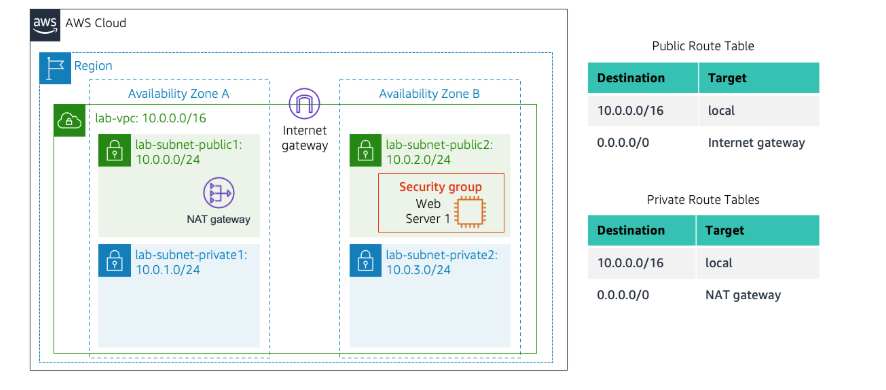
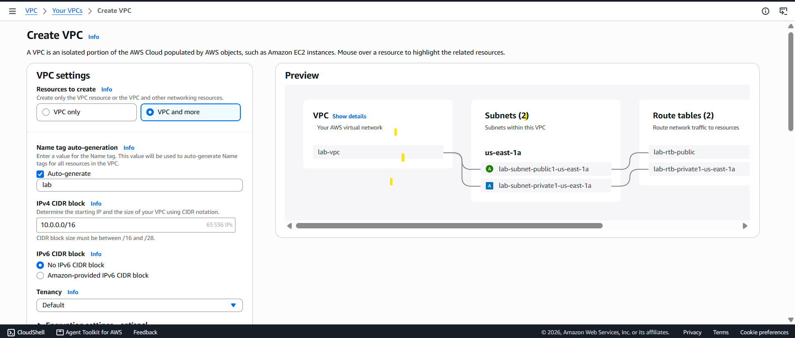
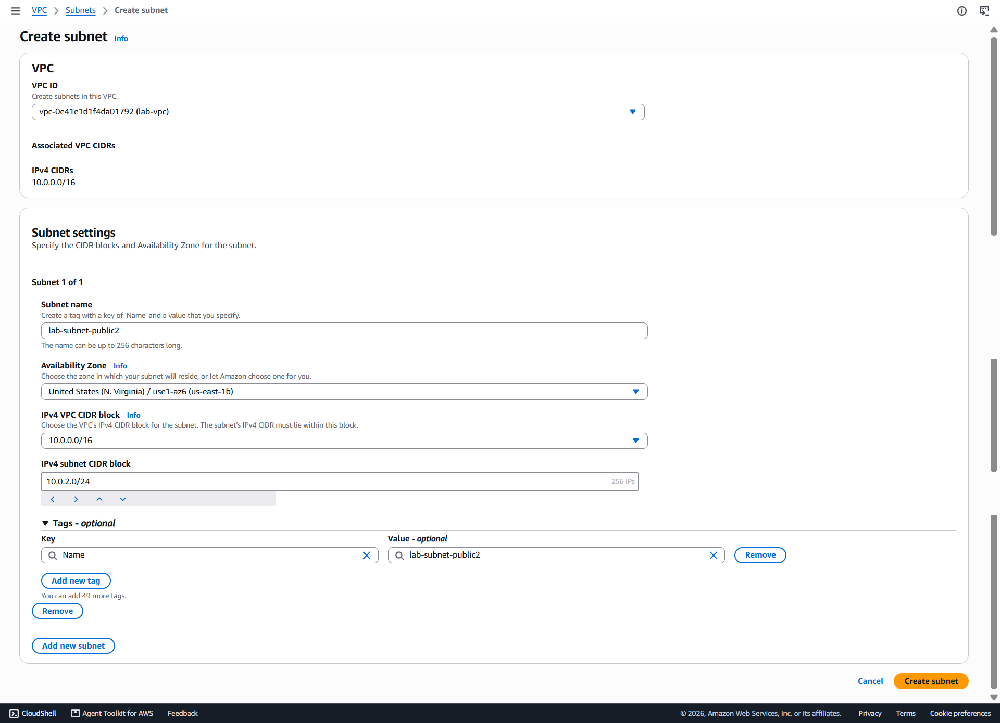
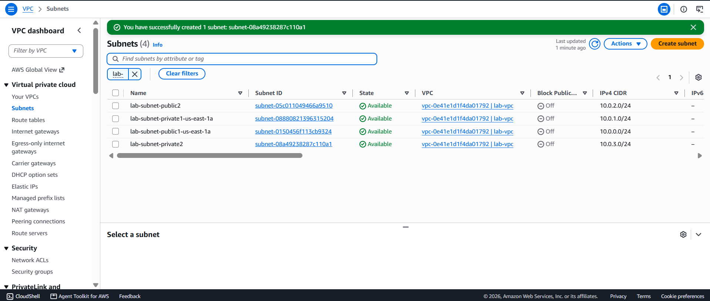
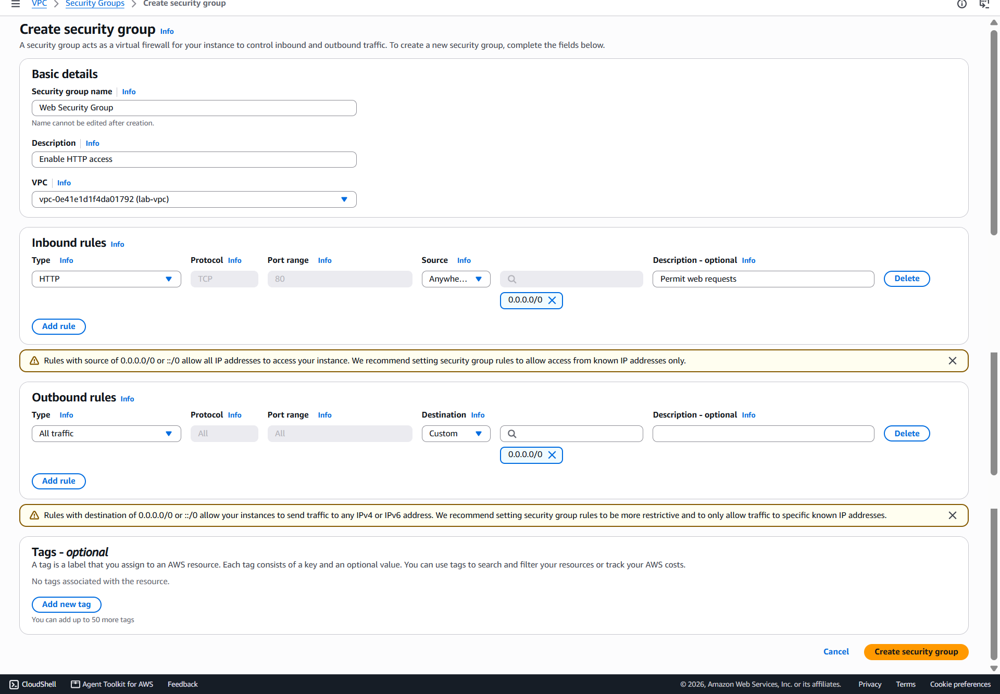
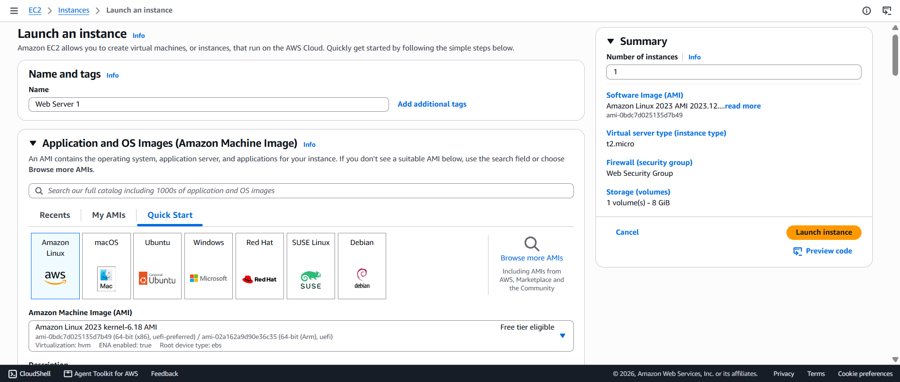

# Lab : Building my own VPC and Launch a Web Server

**Category:** Networking  
**Services Used:** VPC, EC2, Internet Gateway, NAT Gateway, Security Groups

## Overview

In this lab, I built my own Virtual Private Cloud (VPC) on AWS. I created my own private network with public and private subnets, set up gateways to connect to the internet, created a firewall (security group), and launched an EC2 instance running a web server. 

## What I Learned

- How to create and configure a VPC
- Setting up subnets (public ones that connect to the internet, private ones that stay hidden)
- How Internet Gateways work (direct connection to the internet)
- How NAT Gateways work (lets private resources reach the internet without being exposed)
- Creating Security Groups to control traffic to my web server
- Launching and configuring EC2 instances with web servers
- Understanding routing and how traffic flows through the network

---

## What I Built

**VPC: lab-vpc**
- 2 public subnets (can talk to the internet directly)
- 2 private subnets (more secure, hidden from the internet)
- Internet Gateway (lets public subnet connect to internet)
- NAT Gateway (lets private subnet reach internet safely)
- A web server running Apache on an EC2 instance

---

## Step-by-Step Walkthrough

### Step 1: Create the VPC and Initial Resources

Used AWS VPC dashboard to create everything at once:
- VPC CIDR: 10.0.0.0/16 (my private network range)
- Public subnet: 10.0.0.0/24 (in us-east-1a)
- Private subnet: 10.0.1.0/24 (in us-east-1a)
- Internet Gateway (for public subnet to reach internet)
- NAT Gateway (for private subnet to reach internet safely)

>AWS created all the routing tables automatically. The public subnet got a route to the Internet Gateway, and the private subnet got a route to the NAT Gateway.

### Step 2: Add More Subnets in Another Availability Zone

Created 2 more subnets in us-east-1b for redundancy:
- Public subnet 2: 10.0.2.0/24
- Private subnet 2: 10.0.3.0/24

Then I linked these to the existing route tables so they'd have the same traffic rules.

**Why multiple AZs?** If one data center goes down, the other one still works. It's good for reliability.

### Step 3: Create a Security Group

Created a firewall called "Web Security Group" with one rule:
- Allow HTTP traffic (port 80) from anywhere

This lets people access the web server from the internet.

### Step 4: Launch the Web Server

Launched an EC2 instance in the public subnet with:
- **Name:** Web Server 1
- **OS:** Amazon Linux 2023
- **Type:** t2.micro (free tier eligible)
- **VPC:** lab-vpc
- **Subnet:** lab-subnet-public2 (the public one)
- **Public IP:** Enabled (so I can access it from the internet)
- **Security Group:** Web Security Group

I also added a startup script that:
- Installed Apache (web server)
- Installed PHP and MariaDB
- Downloaded and set up a demo web application
- Started the web server

After a couple minutes, the instance was ready and I could access the website via the public IP.

---

## Testing

Everything worked:
-  VPC created with 4 subnets across 2 availability zones
-  Internet Gateway working
-  NAT Gateway working (for private subnets)
-  Route tables configured correctly
-  Security Group allowing HTTP traffic
-  EC2 instance running and passed health checks
-  Web server accessible from browser
-  Website loaded with HTML content "It works"

---

## Challenges I Faced

| Issue | Solution |
|-------|----------|
| EC2 IPv4 address wasn't reachable | Used EC2 Connect to SSH into the instance and troubleshot. Found that the httpd web server wasn't installed (User Data script didn't run properly). I manually installed httpd with `dnf install -y httpd` and started the service with `service httpd start`. After that, the web server was accessible |

---

## Skills I Now Have

- Create and manage VPCs from scratch
- Plan and implement network architecture
- Understand how subnets, gateways, and routing work
- Configure security groups
- Launch and configure EC2 instances
- Use startup scripts to automate server setup
- Basic AWS networking architecture

---

## Useful Things to Remember

- **CIDR notation:** /16 means 65,536 addresses, /24 means 256 addresses
- **Private subnets:** Should route through NAT Gateway to reach the internet
- **Security Groups:** Are stateful (return traffic is allowed automatically)

---
