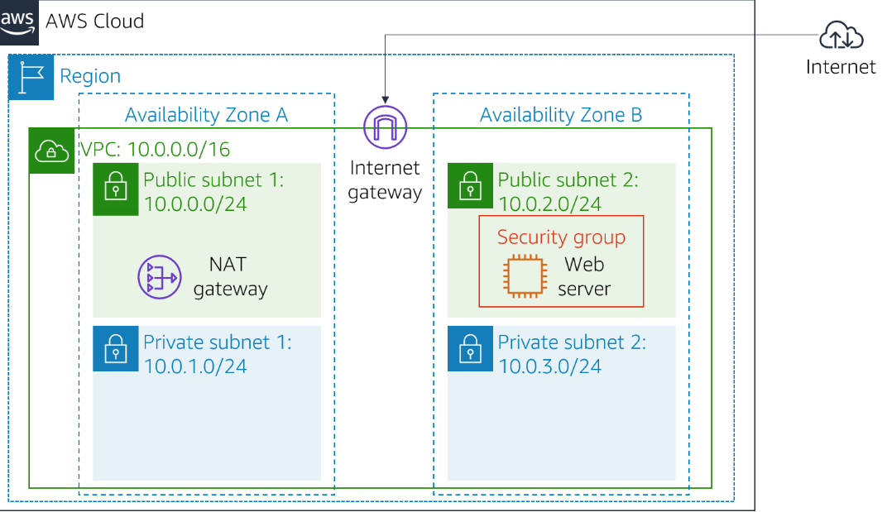
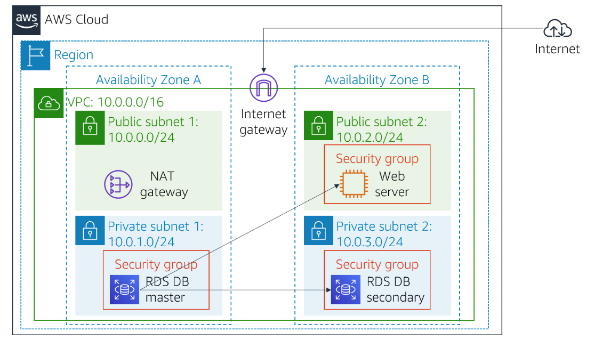
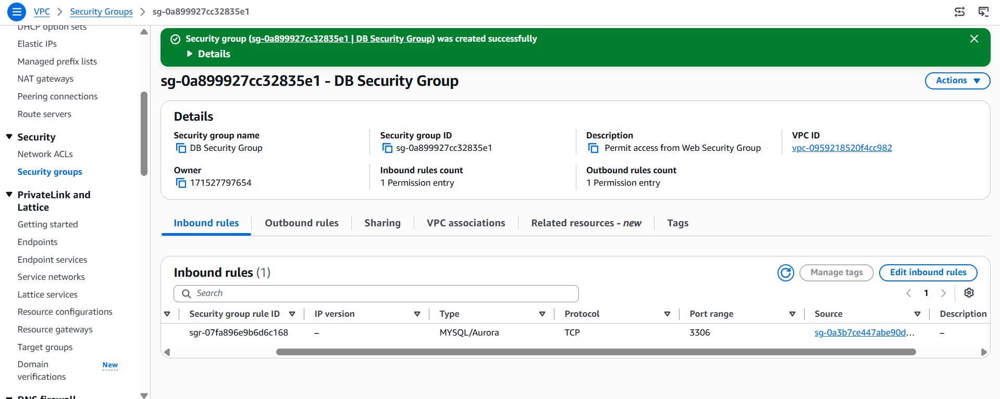
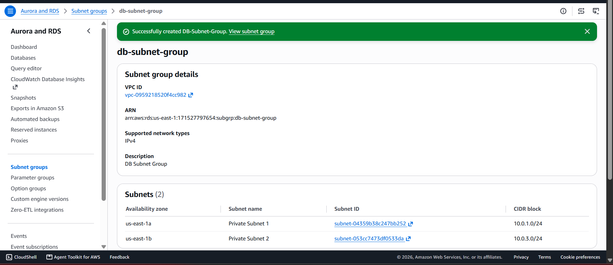
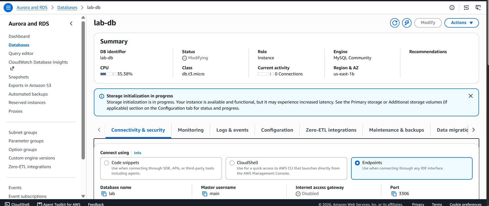
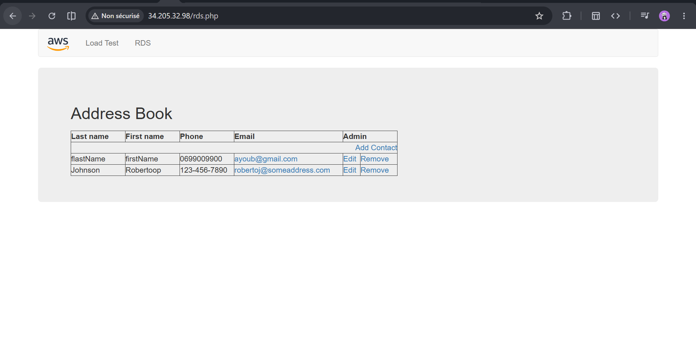

# Lab 05 - Build Your DB Server and Interact With Your DB Using an App

  
> **Category:** Databases  
> **AWS Services:** Amazon RDS, EC2, VPC, Security Groups

## Overview

This lab demonstrates how to deploy a relational database using Amazon RDS and connect it with a web application running on an EC2 instance.

The objective is to understand how AWS managed database services simplify database administration while providing high availability and secure network communication.

---

# Objectives

By completing this lab, I learned how to:

- Create a security group dedicated to database access.
- Configure an Amazon RDS database instance.
- Deploy an RDS database with Multi-AZ availability.
- Establish communication between an EC2 application server and RDS.
- Verify that application data is stored inside the database.

---

# Architecture

## Before the Lab

The environment contained:

- A VPC
- A Web Server running on EC2
- Networking components


## After the Lab

The final architecture:





---

# AWS Services Used

| Service | Purpose |
|---|---|
| Amazon RDS | Managed MySQL database |
| EC2 | Hosts the web application |
| VPC | Provides isolated networking |
| Security Groups | Controls database access |
| Availability Zones | Provides high availability |

---

# Implementation

## 1. Database Security Group

### Goal

Create a network rule allowing only the application server to communicate with the database.

Configuration:

```
Security Group:
DB Security Group

Inbound Rule:

Protocol:
MySQL

Port:
3306

Source:
Web Security Group
```

### Concept Learned

Instead of exposing the database publicly, access is restricted to trusted resources only.

The communication flow becomes:

```
EC2 Web Server
      |
      |
Security Group Rule
      |
      |
RDS Database
```

Screenshot:



---

# 2. DB Subnet Group

## Purpose

A DB subnet group defines which subnets Amazon RDS can use to deploy the database.

Configuration:

```
VPC:
Lab VPC

Availability Zones:
us-east-1a
us-east-1b
```

Selected subnets:

```
10.0.1.0/24 privat subnet1
10.0.3.0/24 privat subnet2
```

## Concept Learned

RDS Multi-AZ deployments require subnets across multiple Availability Zones to provide fault tolerance.

Screenshot:



---

# 3. Creating the RDS Database

## Database Configuration

Engine:

```
MySQL
```

Deployment:

```
Multi-AZ DB Instance
```

Instance:

```
db.t3.micro
```

Storage:

```
General Purpose SSD
20 GB
```

Database:

```
lab
```

---

## Why Multi-AZ?

Multi-AZ creates:

```
Primary Database
        |
        |
Synchronous Replication
        |
        |
Standby Database
```

If the primary database fails, AWS can automatically fail over to the standby instance.

Screenshot:



---

# 4. Connecting the Application to RDS

The web application was configured using:

```
Database Endpoint:
<RDS endpoint>

Database:
lab

Username:
main

Password:
********
```

The application successfully connected to Amazon RDS.

Screenshot:



---

# Testing

The application was tested by:

- Adding contacts
- Updating contacts
- Removing contacts

The changes were stored in the RDS database successfully.

---

# Security Considerations

## Network Security

Implemented:

- Database access restricted through Security Groups.
- Database communication allowed only from the web server.

## Access Control

The application connects using database credentials instead of allowing public access.

## Production Improvements

In a real environment we need to:

- Enable encryption at rest.
- Enable automated backups.
- Store credentials in AWS Secrets Manager.
- Enable monitoring with CloudWatch.
- Place databases in private subnets (wich is we did).

---

# Challenges Encountered
| Problem                         | Solution                                                                                                                                                                                                              |
| ------------------------------- | --------------------------------------------------------------------------------------------------------------------------------------------------------------------------------------------------------------------- |
| My web server wasn't accessible | The problem was caused by entering only the IP address in a new Chrome tab. Chrome tried to use HTTPS by default, while the web server was configured to use HTTP. I needed to access it using `http://xxx.xx.xx.xx`. |

---

# Key Takeaways

## Amazon RDS

I learned that Amazon RDS provides a managed database service where AWS handles:

- Database maintenance
- Hardware provisioning
- Backups
- High availability

## Security Groups

Security Groups act as virtual firewalls that control communication between AWS resources.

## High Availability

Multi-AZ improves database reliability by maintaining a synchronized standby database.

---

# Skills Demonstrated

- Amazon RDS
- MySQL Database Deployment
- VPC Networking
- Security Groups
- Multi-AZ Architecture
- EC2-RDS Integration
- Cloud Database Management

---

