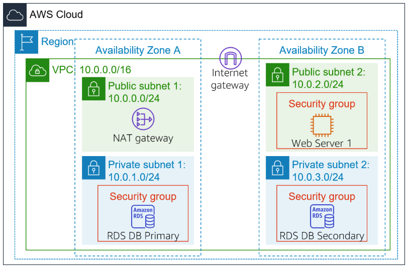
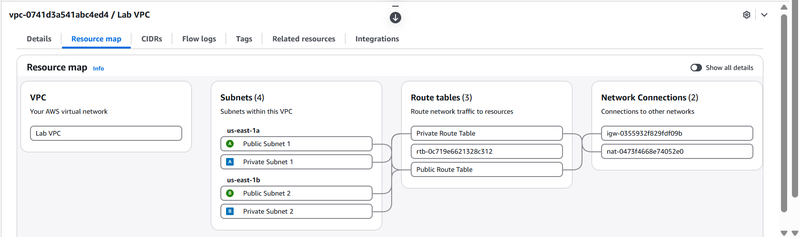
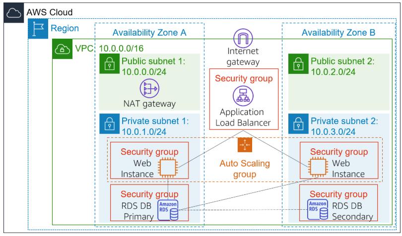
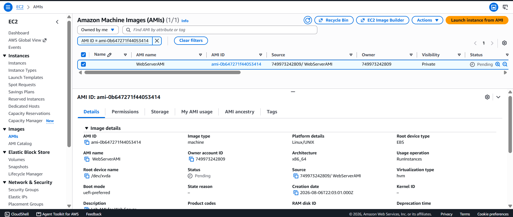
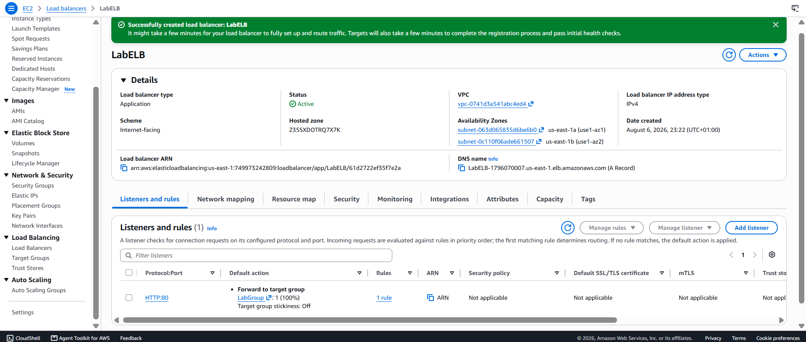
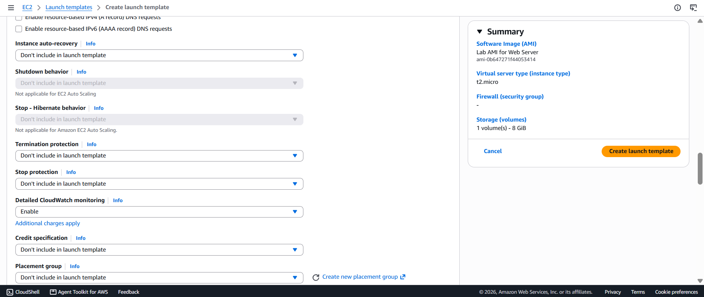
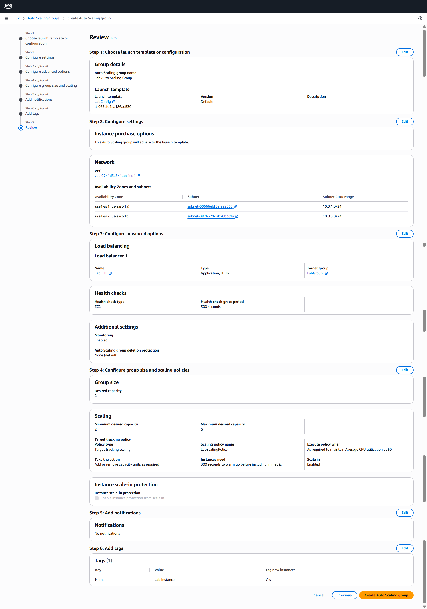
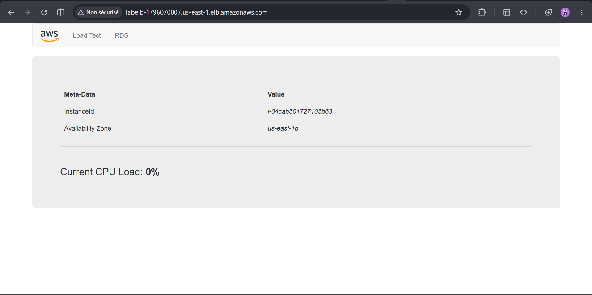
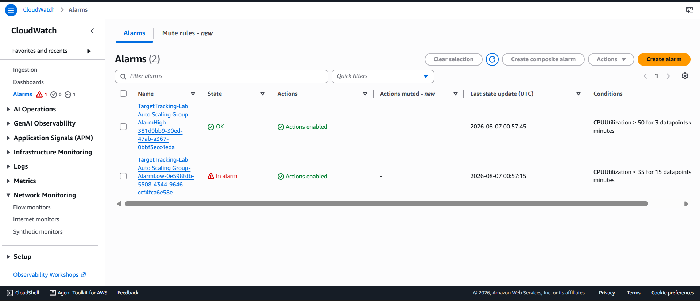
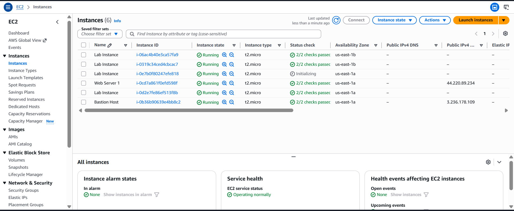

#  Lab :Scale and Load Balance my Architecture

> **Category:** Compute, Networking, Scalability  
> **AWS Services:** EC2, AMI, Elastic Load Balancing, Auto Scaling, CloudWatch, VPC

## Overview

In this lab, I built a scalable and load-balanced web application architecture using Amazon EC2, an Application Load Balancer, and an Auto Scaling Group.

The main goal was to move from a single web server architecture to an architecture that can distribute traffic across multiple EC2 instances and automatically adapt to changes in workload.

The final architecture uses an Application Load Balancer as the entry point for the application, while an Auto Scaling Group manages the EC2 instances behind it.

---

## Objectives

À la fin de ce lab, j'aurai appris à :

- Create an Amazon Machine Image (AMI) from an existing EC2 instance.
- Create an Application Load Balancer.
- Create and configure a Target Group.
- Create a Launch Template for EC2 instances.
- Create and configure an Auto Scaling Group.
- Distribute traffic across multiple EC2 instances.
- Use CloudWatch to monitor infrastructure performance.
- Configure automatic scaling based on CPU utilization.
- Verify that new instances are automatically registered with the Load Balancer.

---

# Architecture

## Before the Lab

The initial environment contained a web server running on an EC2 instance inside the Lab VPC.

The application mainly depended on this single instance. This means that if the instance became unavailable or received too much traffic, the application could be affected.



---

## After the Lab

The final architecture contains an Application Load Balancer and an Auto Scaling Group.

The Load Balancer receives traffic from users and distributes it across healthy EC2 instances.

The Auto Scaling Group manages the number of EC2 instances and can automatically launch or terminate instances depending on the workload.




## AWS Services Used


| **Service**                | **Purpose**                                                       |
| -------------------------- | ----------------------------------------------------------------- |
| Amazon EC2                 | Runs the web application instances                                |
| Amazon Machine Image (AMI) | Provides a reusable template for launching EC2 instances          |
| Application Load Balancer  | Distributes incoming HTTP traffic across healthy instances        |
| Target Group               | Defines the instances that receive traffic from the Load Balancer |
| Auto Scaling Group         | Automatically manages the number of EC2 instances                 |
| Launch Template            | Defines how new EC2 instances should be created                   |
| Amazon CloudWatch          | Monitors metrics and supports automatic scaling                   |
| Amazon VPC                 | Provides the networking environment                               |

## Implementation.

### 1. Create an AMI from the Existing Web Server
>Objective

The first step was to create an Amazon Machine Image from the existing Web Server 1.

The goal was to save the configuration of the existing server and use it as a template for launching new instances.

>Configuration
```text
AMI Name        : WebServerAMI
Description     : Lab AMI for Web Server
Source          : Web Server 1
```
Screenshot:



### 2.Create the Target Group
>Objective

The next step was to create a Target Group that defines where the Load Balancer should send incoming traffic.

>Configuration
```text
Target Type     : Instances
Target Group    : LabGroup
VPC             : Lab VPC
Protocol        : HTTP
Port            : 80
```
#### Concept Learned

>A Target Group contains the resources that can receive traffic from the Load Balancer.

>In this lab, the targets are EC2 instances.

>The Load Balancer does not directly manage individual instances. Instead, it forwards requests to the instances registered in the Target Group.
```text
                    Load Balancer
                          |
                          v
                    Target Group
                    /           \
                   /             \
                  v               v
             EC2 Instance    EC2 Instance
```
## 3. Create the Application Load Balancer 

Objective
The goal of this step was to create a public entry point for the application and distribute incoming traffic across multiple EC2 instances.

Configuration
```text 
Load Balancer : LabELB
Type          : Application Load Balancer
Scheme        : Internet-facing
VPC           : Lab VPC

Subnets:
    Public Subnet 1
    Public Subnet 2

Listener      : HTTP : 80
Target Group  : LabGroup
```
screenshot:



## 4. Create the Launch Template

Objective

The Launch Template defines how new EC2 instances should be created by the Auto Scaling Group.

Configuration
```text
Launch Template : LabConfig
AMI             : WebServerAMI
Instance Type   : t2.micro
Key Pair        : vockey
Security Group  : Web Security Group
CloudWatch      : Detailed Monitoring enabled
```

screenshot :


Concept Learned

A Launch Template acts as a blueprint for launching EC2 instances.

Instead of manually configuring every new instance, the Auto Scaling Group uses the Launch Template to create instances with the same configuration.
```text
                  Launch Template
                         |
          +--------------+--------------+
          |              |              |
          v              v              v
       EC2 #1         EC2 #2         EC2 #3
```

## 5. Create the Auto Scaling Group

Objective

The goal was to create an Auto Scaling Group that automatically manages the number of EC2 instances running the application.

Configuration
```text
Auto Scaling Group : Lab Auto Scaling Group

Minimum Capacity   : 2
Desired Capacity   : 2
Maximum Capacity   : 6

Scaling Policy     : Target Tracking
Metric             : Average CPU Utilization
Target             : 60%
```
screenshot:


## 6. Connect the Auto Scaling Group to the Load Balancer
```text
The Auto Scaling Group was associated with the LabGroup Target Group.

This creates a dynamic relationship between Auto Scaling and the Load Balancer.

When Auto Scaling launches a new EC2 instance, the instance can automatically become a target of the Load Balancer.
```
## 7. Verify Load Balancing
 ### Objective
```text
The next step was to verify that the Load Balancer was correctly distributing traffic to the EC2 instances.

After creating the Auto Scaling Group, two instances were launched automatically because the desired capacity was set to two.

Desired Capacity : 2

EC2 Instance 1 → Healthy
EC2 Instance 2 → Healthy

The Target Group health checks confirmed that the instances were healthy.

An instance that passes the health check can receive traffic from the Load Balancer.
```
Test

I accessed the application using the DNS name of the Load Balancer instead of accessing an EC2 instance directly.

screenshot:



>This confirmed that the Load Balancer was successfully forwarding traffic to the application instances.

## 8. Configure CloudWatch and Automatic Scaling
Objective
```text
The goal of this step was to configure the infrastructure so that it could react automatically when CPU utilization increased.

Scaling Policy

The Auto Scaling Group was configured with a target tracking policy.

Metric : Average CPU Utilization
Target : 60%

The idea is to keep the average CPU utilization of the instances close to 60%.

If CPU utilization stays too high, Auto Scaling can add instances.

If utilization becomes lower, Auto Scaling can remove instances when appropriate.
```
## 9. Test Auto Scaling
Objective
```text

The final test was to generate enough CPU load to trigger the Auto Scaling policy.

The application provided a Load Test function that generated additional workload.

Before the test:

EC2 Instances: 2
Average CPU: Low
Scaling State: Normal

After increasing the workload:

CPU Utilization
       |
       v
   Above target
       |
       v
CloudWatch Alarm
       |
       v
Auto Scaling
       |
       v
Additional EC2 instances

The Auto Scaling Group launched additional instances after the CPU utilization remained high enough to trigger the scaling policy.
```

Result
```text

The test demonstrated that the architecture can automatically increase its capacity when the workload increases.

This is one of the main advantages of cloud infrastructure: capacity can be adjusted automatically instead of requiring manual intervention.
```
screenshot:



## Production Improvements
```text
For a production environment, I would improve this architecture by:

Using HTTPS instead of HTTP.
Using AWS Certificate Manager for TLS certificates.
Keeping application instances in private subnets.
Restricting EC2 traffic to the Load Balancer Security Group.
Using IAM roles instead of storing AWS credentials.
Enabling appropriate CloudWatch monitoring and alarms.
Using Systems Manager instead of direct SSH access where possible.
Adding logging and monitoring for security events.
Using multiple Availability Zones for high availability.
Reviewing Auto Scaling policies according to real application metrics.
```
## Challenges Encountered
| **Problem** | **Solution** |
|---|---|
| Target instances were unhealthy. | After reviewing the configuration, I found that I had not specified the correct health check path. I corrected the configuration and the instances became healthy. |

## Skills Demonstrated
+ Amazon EC2
+ Amazon Machine Images
+ Application Load Balancer
+ Target Groups
+ Launch Templates
+ Auto Scaling Groups
+ CloudWatch Monitoring
+ CloudWatch Alarms
+ Target Tracking Scaling
+ EC2 Health Checks
+ Load Balancing
+ Multi-AZ Architecture
+ VPC Networking
+ High Availability
+ Cloud Scalability